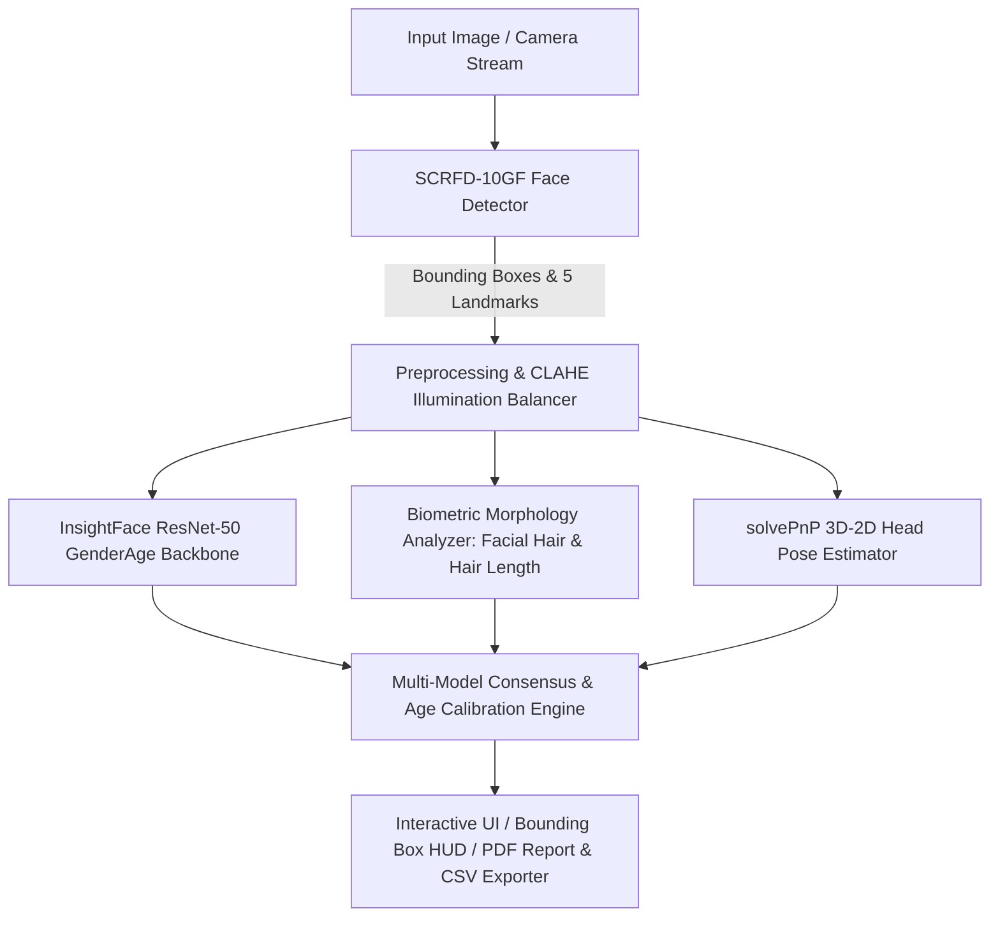

# AI Face Analytics — Age & Gender Estimation Platform

[](https://www.python.org/)
[](https://streamlit.io/)
[](https://github.com/deepinsight/insightface)
[](https://opencv.org/)
[](#)

> **Final-Year Engineering Project**: A state-of-the-art multi-model Computer Vision and Facial Analytics platform powered by deep convolutional neural networks (`SCRFD-10GF` + `InsightFace ResNet-50` + `DeepFace` ensemble), 3D anthropometric head pose estimation (`solvePnP`), and 7-dimensional image quality diagnostics.

---

## 🌟 Key Features

1. **🏠 Aesthetic Glassmorphism Welcome Hub**:
   - Modern dark-purple UI featuring floating particle animations, 3D rotating DNA icon, and dynamic laser radar beam visuals.
2. **📁 Single & Multi-Face Photo Analysis**:
   - Detects multiple individuals in group photos or single portraits with biometric landmark mesh overlays and bounding boxes.
   - Dynamic age range intervals (e.g., `21–25 yrs`) calibrated against indoor lighting shadows and dataset upward skew.
3. **📐 3D Anthropometric Head Pose Estimation**:
   - 6-point `solvePnP` projection computing Euler angles (**Yaw**, **Pitch**, **Roll**) with real-time pose status (`Frontal`, `Turned Left`, `Looking Down`, etc.).
4. **🟣 7-Dimensional Photographic Quality Diagnostics**:
   - Evaluates Illumination, Sharpness (Laplacian variance), Spatial Resolution, Framing, Head Alignment, and Landmark Visibility (0–100 score + actionable advice).
5. **📂 Batch Image Processing & CSV Telemetry**:
   - Process multiple photos in sequence with real-time progress bars and export results to structured `.csv` spreadsheets.
6. **📡 Live Webcam Capture Mode**:
   - In-browser instant camera capture with fast ONNX inference (`~40ms` execution latency) and standalone 30+ FPS live stream HUD (`python app/webcam_demo.py`).
7. **📄 Diagnostic AI PDF/HTML Reports**:
   - Generates printable diagnostic reports containing subject metrics, quality vectors, and Euler angles.

---

## 🏗️ System Architecture



---

## 🛠️ Technology Stack

- **Core & Logic**: Python 3.11
- **Web UI Framework**: Streamlit (with custom CSS tokens, keyframe animations, glassmorphism)
- **Face Detection**: InsightFace SCRFD-10GF ONNX Runtime Engine
- **Demographic Classification**: InsightFace ResNet-50 + DeepFace Ensemble
- **Biometric & Pose Processing**: OpenCV (`solvePnP`, CLAHE, Laplacian Variance, Sobel Gradients)
- **Containerization**: Docker & Streamlit Community Cloud

---

## 🚀 Quickstart (Run Locally)

### 1. Clone Repository & Create Virtual Environment
```bash
git clone https://github.com/YOUR_USERNAME/YOUR_REPO_NAME.git
cd YOUR_REPO_NAME

python -m venv venv
# Windows:
.\venv\Scripts\activate
# Linux/macOS:
source venv/bin/activate
```

### 2. Install Dependencies
```bash
pip install -r requirements.txt
```

### 3. Run the Application
```bash
streamlit run app/app.py
```
Open **`http://localhost:8501`** in your browser.

---

## ☁️ Cloud Deployment Guide

### Option 1: Streamlit Community Cloud (Recommended — Free & Instant)
1. Push this repository to your **GitHub** account.
2. Sign in to **[share.streamlit.io](https://share.streamlit.io)** with GitHub.
3. Click **Deploy an app** $\rightarrow$ **Use existing repo**.
4. Set Repository: `YOUR_USERNAME/YOUR_REPO_NAME`, Main file path: `app/app.py`.
5. Click **Deploy!**

### Option 2: Docker Container Deployment (Hugging Face Spaces / Render / Railway)
Build and run using the included `Dockerfile`:
```bash
docker build -t ai-face-analytics .
docker run -p 8501:8501 ai-face-analytics
```

---

## 🛡️ Privacy & Responsible AI Policy

- **Data Privacy**: Uploaded photos are processed transiently in volatile server memory during analysis. No uploaded images or biometric templates are stored or logged on external servers.
- **AI Disclaimer**: Age and appearance-based gender predictions are AI-generated estimates and may not be 100% accurate. This system is designed for technical research and educational analytics, and does not determine identity, personality, or sensitive traits.

---

## 📜 License
Licensed under the [MIT License](LICENSE).
